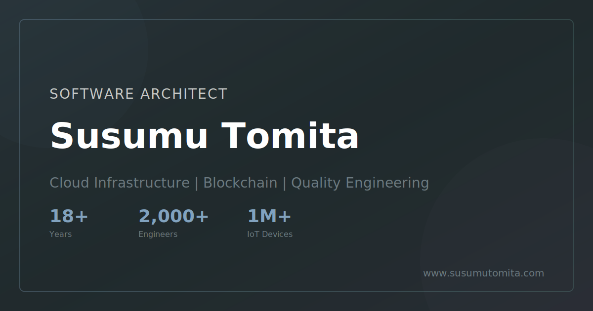

<div align="center">

<a href="https://susumutomita.netlify.app">
  
</a>

# susumutomita.github.io

**Personal portfolio of Susumu Tomita — Software Engineer & Architect.**
Bilingual (JA/EN) site built with Astro, deployed on Netlify and Cloudflare Pages, designed for speed and clarity.

[](https://app.netlify.com/sites/susumutomita/deploys)
[](./LICENSE)
[](https://astro.build)
[](https://bun.sh)
[](https://www.typescriptlang.org)
[](https://github.com/susumutomita/susumutomita.github.io/stargazers)

[**Live site**](https://susumutomita.netlify.app) ·
[**Blog**](https://susumutomita.netlify.app/blog) ·
[**Resume**](https://susumutomita.netlify.app/resume) ·
[**Contact**](https://susumutomita.netlify.app/contact)

</div>

---

## ✨ Highlights

- 🌏 **Bilingual (JA/EN)** — BULL service, TenkaCloud, and contact pages with an inquiry-form CTA
- 🌗 **Adaptive theming** — dark/light with system-preference detection
- 🌐 **Interactive 3D globe** of visited countries (D3.js)
- 📝 **MDX-powered blog** with reading time, RSS, and KaTeX math
- 📄 **Printable resume** with PDF export and a tailored cover letter view
- 🛰 **OG images, sitemap, robots.txt** generated at build
- 🎨 **UnoCSS design tokens** — Tailwind-like ergonomics, atomic CSS output
- ⚡ **Privacy-first** — no Google Analytics, no third-party trackers

## 🚀 Quick start

> Requires [Bun](https://bun.sh) `1.x`. **Do not use** `npm` or `yarn` — the lockfile is `bun.lock`.

```bash
git clone https://github.com/susumutomita/susumutomita.github.io.git
cd susumutomita.github.io
bun install
bun run dev
```

Open [http://localhost:4321](http://localhost:4321).

## 📜 Scripts

| Command | Description |
| :------ | :---------- |
| `bun run dev` | Start the local dev server with HMR |
| `bun run build` | Type-check (`astro check`) and build to `dist/` |
| `bun run preview` | Preview the production build locally |
| `bun run lint` | Run textlint over markdown content |
| `bun run lint:fix` | Auto-fix textlint issues |
| `bun run test:e2e` | Run Playwright end-to-end tests |
| `bun run test:e2e:ui` | Open the Playwright UI runner |

## 🗺 Pages

| Route | Purpose |
| :---- | :------ |
| `/` | Hero, featured work, latest posts |
| `/about` | Background, skills, experience timeline |
| `/projects` | Selected projects and case studies |
| `/papers` | Academic publications and research notes |
| `/blog` | Long-form technical writing (MDX) |
| `/resume` | Career history with print-ready layout |
| `/contact` | Inquiry form, "What I can help with", email & social |
| `/travel` | Interactive 3D globe of visited countries |
| `/ja/*`, `/en/*` | Bilingual BULL pages — services, TenkaCloud, work, contact |

## 🧱 Tech stack

| Layer | Choice |
| :---- | :----- |
| Framework | [Astro 7](https://astro.build) (SSR on Netlify, static on Cloudflare) |
| Language | [TypeScript 6](https://www.typescriptlang.org) |
| Styling | [UnoCSS](https://unocss.dev) with custom tokens in `uno.config.ts` |
| Interactive islands | [Solid.js](https://www.solidjs.com), [Svelte](https://svelte.dev) |
| i18n | Bilingual JA/EN via `src/lib/i18n.ts` |
| 3D / data viz | [D3.js](https://d3js.org) |
| Animations | [Motion](https://motion.dev), [GSAP](https://gsap.com), [Lenis](https://lenis.studiofreight.com) |
| Content | MDX with `remark-math` + `rehype-katex` |
| Testing | [Playwright](https://playwright.dev) |
| Hosting | [Netlify](https://www.netlify.com) (production) and [Cloudflare Pages](https://pages.cloudflare.com) |

## 📁 Project layout

```text
src/
├── components/      Reusable UI (header, footer, islands)
│   └── global/
├── content/         Blog posts (MDX/MD)
├── layouts/         Page layouts (BaseLayout.astro)
├── lib/             Utilities, constants, site metadata
└── pages/           File-based routes
public/
├── fonts/           AXIS Std and fallbacks
├── images/
└── og-image.svg
```

## 🎨 Design system

- **Type stack** — `AXIS Std → Helvetica Neue → Hiragino Kaku Gothic → Noto Sans JP`
- **Color tokens** — defined in [`uno.config.ts`](./uno.config.ts), with `dark:` variants for every surface
- **Density** — generous whitespace, max content width tuned for long-form reading
- **Performance** — Astro islands keep the JS payload small; UnoCSS emits only the classes you use

## 🚢 Deployment

**Netlify (production).** Pushes to `main` trigger an automatic build via [`netlify.toml`](./netlify.toml) (`bun install && bun run build`, SSR via `@astrojs/netlify`). Preview deploys are created for every pull request.

**Cloudflare Pages.** Configured via [`wrangler.jsonc`](./wrangler.jsonc) (`pages_build_output_dir: dist`). When `CF_PAGES` is set, `astro.config.mjs` emits a fully static build (no adapter). Build command: `bun run build` — note that Cloudflare auto-runs `npm install` first, so the build command must **not** add a second `bun install` (the npm + bun hybrid `node_modules` breaks ESM resolution).

**Production:** <https://susumutomita.netlify.app>

## 🤝 Contributing

This is a personal site, but typo fixes, accessibility improvements, and content suggestions are welcome — open an [issue](https://github.com/susumutomita/susumutomita.github.io/issues) or send a pull request.

## 👤 Author

**Susumu Tomita** — Software Engineer & Architect

[](https://github.com/susumutomita)
[](https://www.linkedin.com/in/susumutomita/)
[](https://zenn.dev/bull)
[](https://qiita.com/tonitoni415)

## 📄 License

Source code is released under the [MIT License](./LICENSE). Content (blog posts, papers, images) is © Susumu Tomita and not covered by the MIT grant.
