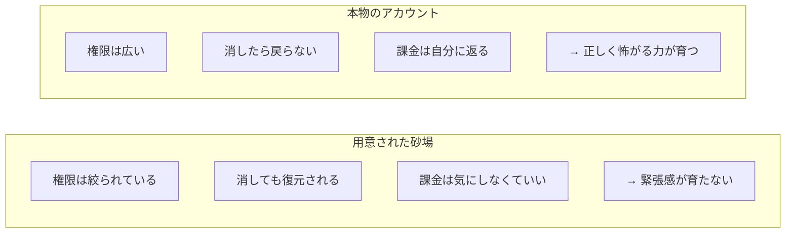
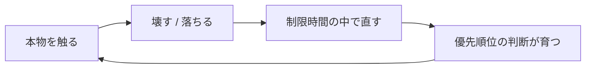

資格を取れば、AWS の用語は分かります。チュートリアルをなぞれば、コンソールの画面も一通り見られます。でも、それで「クラウドが使える」ようになったかというと、たぶん違います。

本番のアカウントを任されて手が震えないか。障害の夜に落ち着いていられるか。消したら戻らないリソースの前で、正しく怖がれるか。その差は、どこで生まれるのでしょうか。

私は、その差は**本物のアカウントを触った時間の中でしか生まれない**と思っています。だから[TenkaCloud](https://www.tenkacloud.com/?lang=ja)という、参加者それぞれの本物の AWS アカウントの上でクラウド競技を開催するプラットフォームを作っています。

## 座学では「使える」にならない

前に、エンジニアは学ぶのではなく作ることでしか成長しない、という話を書きました（[エンジニアは「学ぶ」のではなく「作る」ことでしか成長しない](/blog/engineer-growth-by-building)）。クラウドはその最たるものです。

ハンズオン資料は、手順どおりにコピー&ペーストすれば動きます。動くのですが、そこで自分が決めたことは何もありません。なぜその VPC なのか、なぜその IAM ポリシーなのか、間違えたら何が起きるのか。手を動かしたつもりで、実は一度も判断していない。この「判断していない」感覚が、資料をやり終えても残る物足りなさの正体だと思っています。

## 用意された砂場は、安全すぎる

研修で配られる共有環境は、壊れないように作られています。権限は絞られ、消しても復元され、課金の心配もありません。学びの入り口としては良いのですが、決定的に足りないものがあります。**緊張感**です。

本物の現場は逆です。権限は広く、消せば戻らず、課金は自分に返ってきます。この「戻らなさ」こそが、人を慎重にさせ、設計を考えさせ、確認を習慣づけます。安全な砂場では、その筋肉が育ちません。

## 「本物のアカウントで戦ってもらう」と決めた

TenkaCloud は、参加者それぞれの本物の AWS アカウントに問題環境を配ります。リアルタイムに運用を回す Battle と、自分のペースで解く Challenge があります。共有環境の中の練習ではなく、自分のアカウントで本物のリソースを動かして解いてもらう、という形にしました。

正直に言うと、これは怖い決断でした。他人の AWS アカウントを触る仕組みを作るということ。参加者に課金が発生するということ。もし事故が起きたら、という想像。作らない理由なら、いくらでも思いつきました。

それでも本物にしたのは、**その怖さこそが学びの本体**だと思ったからです。壊せない環境の中では、壊さないための判断は育ちません。取り返しのつく範囲で、本物の怖さに触れてもらう。そこにしか、資格の暗記では届かない実力はないと考えました。

## 怖いから、臆病に作った

怖い仕組みだからこそ、設計は徹底的に守りに寄せました。

参加者のアカウントには、参加者自身が同意して作ったロールを通してしか入りません。しかもそのロールは、合言葉（ExternalId）が正しく添えられたときだけ引き受けを許します。セッションは 1 時間で自動的に切れます。参加者が自分でスタックを消せば、権限もろとも一撃で失効します。

技術的な作り込みの詳細は、Zenn 側の技術記事に分けて書きました。ここで言いたいのは中身そのものではなく、**怖さを消すために設計したのではなく、怖さを引き受けるために設計した**ということです。本物を扱う覚悟と、事故を起こさない臆病さは、両立させないといけない。この両立に一番時間をかけました。

## 競技にしたのは、時間が人を本気にするから

なぜ「学習コンテンツ」ではなく「競技」にしたのか。理由は、ハッカソンの話で書いたことと同じです。**時間制約と競争が、人に「いま本当に必要なことは何か」を問わせる**からです。

スコアがリアルタイムで動きます。隣のチームが先に復旧します。その焦りの中で、参加者は自然と優先順位をつけ始めます。まず何を直すか、何は後回しにできるか、どこから手をつけるか。この身体で覚える優先順位づけは、落ち着いた研修室では絶対に手に入りません。

学びは、この輪をどれだけ速く、どれだけ本気で回せたかで決まります。TenkaCloud は、その輪を安全に、でも本物のまま回せる場所を作りたくて始めました。

## これから

いまは、企業の中での研修や、実際の運用・セキュリティに近い題材、閉じた環境での利用といった使われ方に興味があります。オープンソースとして公開してはいますが、現場で本当に求められる題材や運用のかたちは、作っているだけでは分かりません。そこは、使ってくれる人たちと一緒に育てていきたいところです。

本物は、怖いです。課金も、事故のリスクも、消したら戻らない緊張も、全部ついてきます。それでも、その怖さの向こう側にしか本当の実力はないと信じて、今日も作っています。
