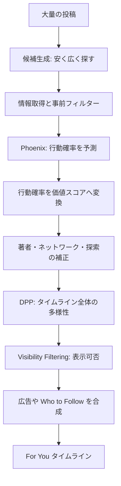
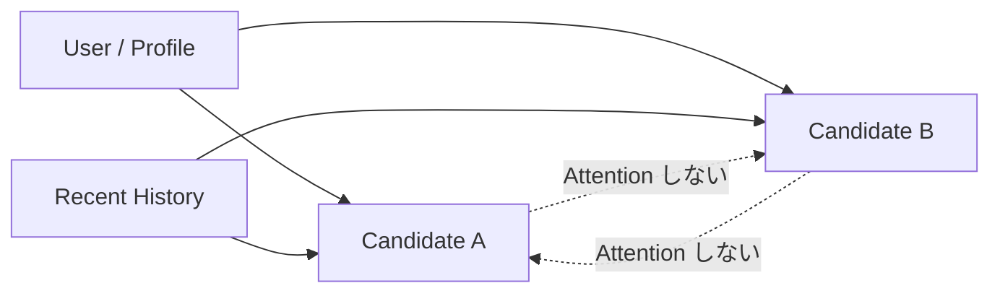

2026 年 8 月 13 日、X は[`xai-org/x-algorithm`](https://github.com/xai-org/x-algorithm)を大幅に更新しました。

以前から X の推薦コードは公開されていましたが、今回の公開はかなり踏み込んでいます。候補を集める処理だけではなく、For You タイムラインで各投稿への反応を予測する Phoenix、学習処理、Rust 製の推論エンジン、反応確率を最終スコアへ変換する重み、同じ話題ばかりになるのを防ぐ DPP、投稿を表示してよいか判断する Visibility Filtering まで含まれています。

Phoenix の README には、今回公開したものを次のように説明しています。

> This release ships the production implementation itself: the real model code, the real training step, and the real Rust serving engine.

単なる概念図ではなく、実際にどう作っているかをコードから追える状態になったということです。

ただし、これで X の本番環境を完全に再現できるわけではありません。実データ、学習済みチェックポイント、本番規模の分散学習、一部のルールやプロンプトは公開されていません。設定値も Feature Switch や A/B テストでユーザーごとに変わる可能性があります。

この記事では、公開直後のコミット[`a389166f6cf5da70a286b568c87695d4dcdce3a1`](https://github.com/xai-org/x-algorithm/tree/a389166f6cf5da70a286b568c87695d4dcdce3a1)を固定して読みます。

私が一番面白いと思ったのは、特定のモデルや重みではありません。X が推薦という難しい問題を、次のように分解していることです。

```text
Retrieval       ≠ Ranking
Prediction      ≠ Product Value
Candidate Score ≠ Timeline Diversity
Exploitation    ≠ Exploration
Ranking         ≠ Safety
```

1 つの巨大な AI にすべてを任せるのではなく、性質の違う問題を別の段階で解いています。この分離が分かると、なぜ For You がこれほど複雑な構成になっているのかが見えてきます。

## そもそも、SNS の「おすすめ」は何が難しいのか

推薦システムを初めて見る人は、次のような処理を想像します。

```text
投稿を全部集める
↓
人気度や関連度を計算する
↓
点数の高い順に表示する
```

小さなサービスなら、この構成でも動作します。しかし X 規模では、少なくとも 5 つの問題が起きます。

1 つ目は、**候補が多すぎる**ことです。世界中の投稿を、ユーザーが画面を開くたびに重い Transformer で採点できません。

2 つ目は、**「良い投稿」の定義が一つではない**ことです。いいねしたい投稿、返信したい投稿、誰かへ送りたい投稿、長く読みたい投稿は同じとは限りません。逆に、興味なし、ミュート、ブロック、通報もあります。

3 つ目は、**各投稿を独立に採点するだけでは、タイムライン全体が悪くなる**ことです。上位十件が同じ著者、同じニュース、同じ動画になる可能性があります。

4 つ目は、**過去の実績だけを信じると、新しい投稿者が永遠に育たない**ことです。表示されない投稿には反応データが集まらず、データがないからさらに表示されないという循環が起きます。

5 つ目は、**面白い投稿と、表示してよい投稿は別問題**であることです。高い反応が予測されても、ブロックした相手、スパム、法的制限のある投稿などは表示すべきではありません。

X の For You は、これらを一本のスコアだけで解こうとしていません。



以下、この順番に見ていきます。

## 1. 最初に候補を絞る — Retrieval と Ranking は別問題

Phoenix の Ranking モデルは Transformer です。公開されている本番向け設定では、埋め込み次元が 2,560、Transformer が 8 層、ユーザーの履歴長が 1,022 あります。

精密な予測ができる代わりに、計算は軽くありません。

仮に推薦対象が一千万件あるとして、一千万件すべてをこのモデルへ入れるのは現実的ではありません。そのため、大規模な推薦システムでは一般に二段階へ分けます。

```text
Retrieval
大量の投稿から、関係がありそうな候補を安く拾う

Ranking
絞られた候補だけを、重いモデルで精密に評価する
```

X も同じ構成です。

[`phoenix_candidate_pipeline.rs`](https://github.com/xai-org/x-algorithm/blob/a389166f6cf5da70a286b568c87695d4dcdce3a1/home-mixer/candidate_pipeline/phoenix_candidate_pipeline.rs)では、候補の取得元が配列として並んでいます。

```rust
let sources: Vec<Box<dyn Source<ScoredPostsQuery, PostCandidate>>> = vec![
    thunder_source,
    tweet_mixer_source,
    simclusters_source,
    phoenix_source,
    phoenix_topics_source,
    phoenix_moe_source,
    cached_posts_source,
];
```

1 つの検索手法だけを使わず、複数の経路から投稿を集めています。

### Thunder — For You でもフォロー関係を捨てない

Thunder は、フォローしているアカウントの最近の投稿を返します。公開されているデフォルト値では、最大 1,200 件です。

```rust
param!(
    ThunderMaxResults,
    u32,
    "rust_home_mixer_thunder_max_results",
    1200
);
```

For You なのだから、フォロー関係を無視して純粋な AI 推薦にしてもよさそうに見えます。しかし、フォローは非常に強いシグナルです。

クリックは偶然でも発生しますが、フォローは「今後もこの人を見たい」という明示的な意思表示です。短期的な興味だけではなく、長期的な関心を表している可能性があります。

X は TikTok のような内容中心の発見だけには寄せず、ソーシャルグラフを候補生成の主要経路として残しています。

### Phoenix Retrieval — Two-Tower で大量候補を探す

フォロー外から候補を探す中心が Phoenix Retrieval です。

Phoenix Retrieval は**Two-Tower**と呼ばれる構成です。ユーザーと投稿を別々のモデルでベクトルへ変換し、内積が大きい投稿を探します。

```text
ユーザー側                           投稿側
────────                           ────────
最近の閲覧・反応履歴                投稿の意味
国・言語など                        著者
        │                            │
        ▼                            ▼
   user vector                  post vector
        │                            │
        └──────── 内積 ──────────────┘
                     ↓
                  類似度
```

ユーザーと投稿を同じベクトル空間へ写せば、後は近傍検索を使えます。一件ずつ Transformer で詳しく比較するより、はるかに安く大量候補を絞れます。

公開されているデフォルトでは、Phoenix source は有効で、最大 1,000 件を返します。

```rust
param!(
    PhoenixMaxResults,
    u32,
    "rust_home_mixer_phoenix_max_results",
    1000
);

param!(
    EnablePhoenixSource,
    bool,
    "rust_home_mixer_enable_phoenix_source",
    true
);
```

#### ユーザー ID を丸暗記しない

Phoenix の README には、production retrieval について`use_user_embedding=False`と書かれています。

これは「ユーザー ID だけを見て、この人はこれが好きだと丸暗記する埋め込み」を中心にしないという意味です。最近の行動履歴と、国や言語などの粗いプロフィールからユーザー表現を作ります。

この設計には、次の利点があると考えられます。

- 新規ユーザーにも適用しやすい
- 興味の変化へ追従しやすい
- 巨大なユーザー ID 辞書への依存を減らせる
- 「過去に誰だったか」より「最近何をしたか」を重視できる

ただし、Ranking 側には hashed user feature があります。X がユーザー ID を一切使わないという意味ではありません。

### Semantic ID — 新着投稿を内容から理解する

投稿を ID だけで表すと、新着投稿に弱くなります。

昨日から大量に表示されている投稿には、誰がいいねしたか、誰が長く読んだかという反応データがあります。一方、投稿されたばかりの内容には反応データがありません。

ID だけを見るモデルには、新着投稿が「何についての投稿か」が分かりません。これは item cold-start と呼ばれる問題です。

Phoenix は投稿に**Semantic ID**を持たせます。本番向け設定では、256 種類のコードを 6 段使います。

```text
Semantic IDs: 6 × 256
```

イメージとしては、投稿のテキストや画像をベクトルへ変換し、それを残差量子化して離散的なコードへ圧縮します。

```text
「Rust の所有権について説明した投稿」
                 ↓
       multimodal embedding
                 ↓
[0.12, -0.41, 0.87, ...]
                 ↓
       residual quantization
                 ↓
[42, 8, 201, 17, 93, 4]
```

投稿 ID だけなら、未知の投稿は完全に未知です。Semantic ID があれば、新着投稿でも過去の似た内容とコードの一部を共有できます。

X は新着性が重要なサービスです。投稿直後から内容を使って候補化できるこの設計は、X と相性がよいと考えられます。

### SimClusters — 内容が似ていることと、好む人が似ていることは違う

Phoenix Retrieval が意味的な近さを扱えるなら、別の候補源は不要にも見えます。しかし、文章が似ていることと、同じ人々が好むことは一致しません。

例えば、次の 2 つは文章上かなり近いでしょう。

```text
A: Rust はメモリ安全性が高い
B: C++ のメモリ安全性を改善する
```

一方、次の投稿は文章上の単語が違っていても、A を好む人々が強く反応するかもしれません。

```text
C: 新しい Zig コンパイラがリリースされた
```

SimClusters は「誰が何へ反応したか」という集団行動から、ユーザーや投稿を興味クラスタへ写します。

```text
Phoenix Retrieval
内容や最近の行動履歴から近い投稿を探す

SimClusters
似た人々・似たコミュニティが反応した投稿を探す
```

2 つは競合ではなく補完関係です。複数経路を持つことで、1 つのモデルが見落とした候補を別の経路が拾えます。

推薦用語では、この段階で重視するのは precision より recall です。完璧な順位を付ける必要はなく、後段で高く評価される可能性がある投稿を取りこぼさないことが重要です。

## 2. 候補へ情報を足し、明らかに不適格なものを落とす

取得した候補は、そのまま Phoenix へ渡されません。

まず hydration と呼ばれる処理で、投稿本文、著者、フォロー関係、メディア情報、反応件数、Semantic ID などを取得します。その後、Ranking 前のフィルターを通します。

[`phoenix_candidate_pipeline.rs`](https://github.com/xai-org/x-algorithm/blob/a389166f6cf5da70a286b568c87695d4dcdce3a1/home-mixer/candidate_pipeline/phoenix_candidate_pipeline.rs)には、次のようなフィルターがあります。

```rust
let filters: Vec<Box<dyn Filter<ScoredPostsQuery, PostCandidate>>> = vec![
    Box::new(DropDuplicatesFilter),
    Box::new(CoreDataHydrationFilter),
    Box::new(AgeFilter::new(Duration::from_secs(params::MAX_POST_AGE))),
    Box::new(SelfTweetFilter),
    Box::new(OONRetweetReplyFilter),
    Box::new(OONNsfwSimclustersFilter),
    Box::new(RetweetDeduplicationFilter),
    Box::new(IneligibleSubscriptionFilter),
    Box::new(PreviouslySeenPostsFilter),
    Box::new(PreviouslySeenPostsBackupFilter),
    Box::new(PreviouslyServedPostsFilter),
    Box::new(MutedKeywordFilter::new()),
    Box::new(AuthorSocialgraphFilter),
    Box::new(VideoFilter),
    Box::new(TopicIdsFilter),
    Box::new(NewUserMinEngagementFilter),
    Box::new(InventoryHoldoutFilter),
];
```

具体的には、次のような投稿を除外します。

- 複数 source から返った同一投稿
- 本文やメタデータを取得できなかった投稿
- 48 時間より古い投稿
- 自分自身の投稿
- 条件を満たさないフォロー外の返信・リポスト
- 既に見た投稿、同じセッションで既に配信した投稿
- ミュートしたキーワードを含む投稿
- ブロック・ミュートした著者
- 閲覧権限のない購読者限定投稿
- 動画を除外するリクエストに対する動画投稿

これらを AI に低スコア判定させないのはなぜでしょうか。

理由は、**関連度と表示資格は別だから**です。

ブロックした相手の投稿は、面白いかどうかを予測する対象ではありません。購読者限定投稿も、関連度が高くても権限がなければ表示できません。既に見た投稿も、モデルが再び高く評価したからといって何度も出すべきではありません。

明確な制約を hard filter として分離すると、次の利点があります。

- 不要なモデル推論を減らせる
- ルールを確実に守れる
- モデルの学習や drift に左右されない
- 何を理由に落としたか説明しやすい

機械学習に任せる部分と、決定的なルールで扱う部分を分けているわけです。

## 3. Phoenix Ranking — 「良い投稿」ではなく、次の行動を予測する

候補が絞られると、Phoenix Ranking が各投稿を評価します。

ここで Phoenix は、単一の`relevance_score`や「良い投稿である確率」を直接出しません。代わりに、ユーザーがその投稿へどんな行動を取るかを複数の head で予測します。

主な出力は次のとおりです。

| 種類 | 予測する行動 |
|---|---|
| 反応 | いいね、返信、リポスト、引用 |
| 共有 | 通常共有、DM 共有、リンクコピー共有 |
| クリック | 投稿、プロフィール、外部リンク、画像、動画、引用投稿 |
| 注目 | 動画品質視聴、滞在、滞在時間、クリック後滞在時間、active seconds |
| 著者 | 著者をフォロー |
| 否定 | 興味なし、著者をミュート、著者をブロック、通報、ほぼ見ずに通過 |

### なぜ「良い投稿」を直接予測しないのか

「良い投稿」という正解ラベルは存在しません。

しかし、ユーザーが次の行動をしたかどうかは観測できます。

```text
いいねした
返信した
30 秒読んだ
著者をフォローした
ミュートした
通報した
```

そこで機械学習には、観測可能な将来行動を予測させます。

その後、プロダクト側が次の価値判断を下します。

```text
返信はどの程度価値があるか
共有はどの程度価値があるか
通報リスクをどの程度避けるか
```

これは**Prediction と Decision の分離**です。

モデルを再学習しなくても、行動の価値を表す重みを変えればプロダクトの目的を調整できます。逆に、同じ行動価値のまま予測モデルだけを改善できます。

### PhoenixScorer の責務は予測値を載せるだけ

[`phoenix_scorer.rs`](https://github.com/xai-org/x-algorithm/blob/a389166f6cf5da70a286b568c87695d4dcdce3a1/home-mixer/scorers/phoenix_scorer.rs)は、推論サービスを呼び、候補へ各 action score を格納します。

```rust
candidates
    .iter()
    .map(|c| PostCandidate {
        phoenix_scores: predictions.candidate_scores(&c.get_original_tweet_id()),
        prediction_request_id: Some(query.prediction_id),
        last_scored_at_ms,
        ..Default::default()
    })
```

この段階では、どの行動が何点かを決めていません。予測と価値判断がコード上でも別コンポーネントになっています。

## 4. Phoenix は何を入力として見ているのか

[`phoenix_request.rs`](https://github.com/xai-org/x-algorithm/blob/a389166f6cf5da70a286b568c87695d4dcdce3a1/home-mixer/util/phoenix_request.rs)を見ると、入力はかなり広範です。

ClientContext には、次のようなフィールドがあります。

```rust
Some(ClientContext {
    user_id: query.user_id as i64,
    app_id: query.client_app_id as i64,
    country_code: query.country_code.clone(),
    language_code: query.language_code.clone(),
    user_roles: query.user_roles.clone(),
    ip_address: query.ip_address.clone(),
    client_version: query.client_version.clone(),
    ..Default::default()
})
```

UserContext には、年齢帯、性別、推定性別とスコア、地域、フォロー中の Grok Topics、Starter Packs、インストール済みアプリなどがあります。DeviceFeature には、ネットワーク種別、タイムゾーン、IP アドレスなどがあります。

投稿側にも、次のような情報があります。

- 投稿 ID、著者 ID
- 返信・引用・リポストか
- メディアの有無
- 動画時間
- いいね、返信、リポスト、引用、表示、ブックマークの件数
- 言語
- 著者とのフォロー関係
- Semantic ID
- 投稿からの経過時間

ここで注意が必要です。

コードにフィールドが存在することは確認できますが、**各フィールドが実際の予測へどの程度効いているかは、このコードだけでは分かりません**。Feature Switch で hydration が無効になる場合もあり、モデル設定によって使われない入力もあります。

「インストール済みアプリがフィールドにある」と「それが推薦を支配している」は別の主張です。記事ではこの線を越えないようにします。

## 5. Candidate Isolation — 候補同士を Transformer で見せない

Phoenix Ranking の設計で特に面白いのが**Candidate Isolation**です。

通常の Transformer へ複数候補を 1 つの列として入れると、候補 A が候補 B を Attention で見ることができます。すると A のスコアは、同じバッチに B がいるかどうかで変わります。

Phoenix は、候補同士の Attention を禁止します。

```text
候補 A → ユーザー情報       許可
候補 A → 行動履歴           許可
候補 A → 候補 A 自身        許可
候補 A → 候補 B             禁止
```



### なぜ候補同士を見せないのか

最大の理由は**batch invariance**です。

同じユーザー、同じ投稿なら、バッチの組み合わせが変わっても同じ予測値になります。

これには大きな運用上の利点があります。

- 候補の組み合わせでスコアが揺れない
- キャッシュしやすい
- 候補 source の都合で順位が不安定にならない
- バッチングを変えても意味が変わらない
- 投稿ごとの予測を監査しやすい

一方で、欠点もあります。モデル自身は「この二件を並べると内容が重複する」「A の次は B より C がよい」といったタイムライン全体の関係を学べません。

X はその問題を後段の DPP へ分離しています。

```text
Phoenix
各投稿を独立に評価する

DPP
投稿集合として重複を減らす
```

個別予測の安定性と、一覧全体の多様性を別問題として扱っています。

## 6. RankingScorer — 行動確率を X の価値へ変換する

Phoenix が複数の行動確率を出した後、[`ranking_scorer.rs`](https://github.com/xai-org/x-algorithm/blob/a389166f6cf5da70a286b568c87695d4dcdce3a1/home-mixer/scorers/ranking_scorer.rs)が 1 つのスコアへ変換します。

基本式は非常に明快です。

$$
\mathrm{Score}=\sum_i w_i P(\mathrm{action}_i \mid \mathrm{viewer},\mathrm{post})
$$

コード上も、予測値へ重みを掛けています。

```rust
fn apply(score: Option<f64>, weight: f64) -> f64 {
    score.unwrap_or(0.0) * weight
}
```

そして各 head を列挙します。

```rust
let terms = [
    Self::apply(scores.favorite_score, weights.favorite),
    Self::apply(scores.reply_score, weights.reply_weight_for(candidate)),
    Self::apply(scores.retweet_score, weights.retweet),
    Self::apply(scores.click_score, weights.click),
    Self::apply(scores.open_link_score, weights.open_link),
    Self::apply(scores.share_score, weights.share),
    Self::apply(scores.share_via_dm_score, weights.share_via_dm),
    Self::apply(
        scores.share_via_copy_link_score,
        weights.share_via_copy_link,
    ),
    Self::apply(scores.follow_author_score, weights.follow_author),
    Self::apply(scores.not_interested_score, weights.not_interested),
    Self::apply(scores.block_author_score, weights.block_author),
    Self::apply(scores.mute_author_score, weights.mute_author),
    Self::apply(scores.report_score, weights.report),
    // ...
];
```

### 公開されたデフォルト重み

[`param.rs`](https://github.com/xai-org/x-algorithm/blob/a389166f6cf5da70a286b568c87695d4dcdce3a1/home-mixer/params/param.rs)の先頭には、デフォルト値が 2026 年 8 月 12 日に production config から同期されたと書かれています。

```rust
// mirrored from config feature-switch defaults; last sync 2026-08-12T04:09:22Z
```

主な値は次のとおりです。

| 行動 | 重み |
|---|---:|
| いいね | +0.5 |
| 返信 | +5.0 |
| リポスト | +1.0 |
| 引用 | +5.0 |
| 通常共有 | +2.0 |
| DM 共有 | +5.0 |
| リンクコピー共有 | +20.0 |
| 投稿クリック | +0.4 |
| 外部リンククリック | +0.2 |
| プロフィールクリック | 0.0 |
| 画像拡大 | +0.05 |
| 動画開始 | +0.05 |
| 動画品質視聴 | +0.05 |
| 著者をフォロー | +4.0 |
| 未探索投稿 | +0.02 |
| 連続滞在時間 | +0.004 |
| discrete dwell | 0.0 |
| クリック後滞在時間 | 0.0 |
| 興味なし | -43.2 |
| 著者をブロック | -31.2 |
| 著者をミュート | -58.8 |
| 通報 | -234.0 |
| ほぼ見ずに通過 | -0.02 |

この表は、X が何を価値と見ているかを考える材料になります。しかし、「返信一件はいいね十件分」と読むのは誤りです。

コード中のコメントにも、重みは行動の価値だけではなく、ネットワーク全体でその行動が起きる確率も考慮していると書かれています。

例えば、次の 2 つは同じ寄与になります。

```text
いいね確率 10% × 0.5 = 0.05
リンクコピー共有確率 0.25% × 20 = 0.05
```

リンクコピー共有は重みが大きい一方、発生確率が低い行動です。重みだけを比べても、実際の寄与は分かりません。

同様に通報の -234 は非常に大きく見えますが、通報はまれな行動です。それでも、わずかな通報確率が複数の肯定的反応を打ち消せるように設計されています。

### なぜ共有と返信を強く評価するのか

ここからは推測を含みます。

いいねは低コストな反応です。一方、返信、引用、DM 共有、リンクコピー共有には、より強い意図があります。

- 返信は会話を生みます
- 引用は新しい投稿と議論を生みます
- DM 共有は特定の相手へ届けたい意思です
- リンクコピー共有は X の外へ持ち出す可能性があります
- 著者フォローは 1 回の閲覧を長期関係へ変えます

X は、単にスクロールを止める投稿より、ネットワークを動かす投稿を強く評価しているように見えます。

一方、`DwellWeight`は 0 ですが、連続滞在時間の重みは 0.004 です。「滞在したか」という二値 head より、何秒滞在したかという連続値を使っていると読めます。

プロフィールクリックが 0 なのも興味深い点です。Phoenix は予測していても、現在のデフォルトでは価値へ加えていません。予測 head と価値重みを分けているため、モデルを再学習せずに有効化できます。

### 外部リンクはコード上、直接マイナスではない

X では「外部リンクを貼ると表示されにくい」とよく言われます。

少なくともこの公開デフォルトでは、`OpenLinkWeight`は`+0.2`です。外部リンククリックそのものを負の値にしているわけではありません。

ただし、ここから「外部リンク付き投稿は必ず有利」とも言えません。

- 投稿内容によって他の予測確率が変わる
- 候補生成段階で差が出る可能性がある
- Visibility Filtering や別の実験がある
- リンクを開いてすぐ離脱する場合、他の signal が弱くなる

公開コードから言えるのは、「最終 weighted score のデフォルト式に、外部リンククリックを直接減点する項は見当たらない」という範囲です。

## 7. スコアを非負へ写し、0 を特別な値として残す

`RankingScorer`は単純に合計した後、`offset_score`を通します。

```rust
pub(crate) fn offset_score(combined_score: f64, w: &ScoringWeights) -> f64 {
    if w.total_sum == 0.0 {
        combined_score.max(0.0)
    } else if combined_score < 0.0 {
        (combined_score + w.negative_sum) / w.total_sum * NEGATIVE_SCORES_OFFSET
    } else {
        combined_score + NEGATIVE_SCORES_OFFSET
    }
}
```

`NEGATIVE_SCORES_OFFSET`は 0.001 です。

この変換により、負の合計スコアはおおむね 0 以上 0.001 未満へ入り、非負の合計スコアは 0.001 以上になります。

```text
悪い候補     0.0000 ... 0.0009
非負の候補   0.0010 ...
除外候補     0
```

0 を DPP などの後段で「選ばれなかった候補」として使いやすくしつつ、負の予測を持つ候補同士の順序も残すためだと考えられます。

## 8. 相互フォローの投稿は、返信される価値を強く見る

現在のデフォルトでは、通常の返信重みは 5.0 ですが、相互フォロー相手の条件を満たす投稿には 15.0 が追加されます。

```rust
param!(ReplyWeight, f64, "rust_home_mixer_reply_weight", 5.0);

param!(
    BidirectionalFollowReplyWeightBoost,
    f64,
    "rust_home_mixer_bidirectional_follow_reply_weight_boost",
    15.0
);
```

ただし、既に返信である投稿を優遇するわけではありません。

[`ranking_scorer.rs`](https://github.com/xai-org/x-algorithm/blob/a389166f6cf5da70a286b568c87695d4dcdce3a1/home-mixer/scorers/ranking_scorer.rs)の条件は次のとおりです。

```rust
fn bidirectional_boost_eligible(candidate: &PostCandidate) -> bool {
    candidate.in_reply_to_tweet_id.is_none()
        && candidate.retweeted_tweet_id.is_none()
        && candidate.is_mutual_follow_author == Some(true)
}
```

対象は次の組み合わせです。

```text
相互フォロー相手のオリジナル投稿
+
その投稿へ自分が返信する予測確率
```

を強く評価します。

通常の 5.0 に 15.0 が加わるので、実質 20.0 です。

これは、X が相互フォロー間の会話を意図的にタイムラインへ戻そうとしていると読めます。

[`BIDIRECTIONAL_BOOST_CHANGE.md`](https://github.com/xai-org/x-algorithm/blob/a389166f6cf5da70a286b568c87695d4dcdce3a1/docs/BIDIRECTIONAL_BOOST_CHANGE.md)には、2026 年 7 月に 5、10、15、20 を A/B テストし、一度 20 を広く展開した後、フォロー外の話題が見えにくいという反応も踏まえて 15 へ調整した経緯が書かれています。

ここから分かるのは、アルゴリズムが単なるモデルではなく、**プロダクト方針を設定値として運用する仕組み**だということです。

## 9. 同じ著者ばかりにならないように減衰する

各投稿を独立に高い順へ並べると、同じ著者が上位を占める可能性があります。

例えば、あるニュースアカウントが短時間に十件投稿し、すべてがユーザーの興味へ合っていたとします。各投稿だけを見れば十件とも高得点です。しかし、タイムライン全体として十件連続は望ましくありません。

X は Author Diversity を明示的に適用します。

```rust
fn diversity_multiplier(decay_factor: f64, floor: f64, exponent: f64) -> f64 {
    (1.0 - floor) * decay_factor.powf(exponent) + floor
}
```

公開デフォルトは次の値です。

```text
decay = 0.5
floor = 0.25
```

同じ著者の出現回数を`k`とすると、倍率は次のようになります。

| 同じ著者の何件目か | k | 倍率 |
|---|---:|---:|
| 1 件目 | 0 | 1.0000 |
| 2 件目 | 1 | 0.6250 |
| 3 件目 | 2 | 0.4375 |
| 4 件目 | 3 | 0.34375 |
| 多数出た場合 | 大 | 0.25 へ近づく |

完全に禁止するのではなく、最初の一件はそのまま、二件目以降を徐々に弱くします。非常に強い投稿なら残れますが、同程度の別著者がいれば入れ替わりやすくなります。

これは投稿単体の品質ではなく、**slate、つまり一覧全体の品質**を扱う処理です。

## 10. フォロー外投稿には 0.75 倍のハンデがある

公開デフォルトでは、Out-of-Network、つまりフォロー外投稿へ 0.75 の係数を掛けます。

```rust
param!(
    OonWeightFactor,
    f64,
    "rust_home_mixer_oon_weight_factor",
    0.75
);
```

トピック指定時は 0.5 です。

また、デフォルトではフォロー中アカウントの投稿でも、返信やリポストには同様の減衰を適用します。

なぜフォロー外を一律に弱めるのでしょうか。

Phoenix が高精度なら、フォロー内・外を同じ土俵で採点してもよさそうです。しかし、フォローは長期的で明示的な preference です。行動履歴からの予測にはノイズや一時的な興味があります。

この係数は、次の 2 つを両立させる設計です。

```text
明示的なソーシャル関係を prior として残す
+
ただし強いフォロー外候補は追い越せる
```

このため、フォロー外候補は不利ですが、十分に強ければフォロー内候補を追い越せます。

完全な Following タイムラインでも、完全な discovery feed でもありません。X の For You は、ソーシャルグラフと行動予測を混ぜたハイブリッドです。

## 11. 新しい著者を意図的に試す — Cold Start Boost

過去の反応だけで順位を決めると、人気者がさらに表示され、新しい著者は表示されません。

```text
表示されない
↓
反応データが集まらない
↓
モデルが評価できない
↓
さらに表示されない
```

これは推薦システムの自己強化ループです。

X は Cold Start Boost を明示的に持っています。公開デフォルトで主な条件は次のとおりです。

| 条件 | デフォルト |
|---|---:|
| 著者フォロワー数 | 1,000 以下 |
| 投稿表示数 | 1,000 未満 |
| 対象投稿 | オリジナル投稿 |
| 投稿年齢 | 実験条件では 24 時間以内 |
| 持ち上げ先 | おおむね 16 番目のスコア |
| 元順位の対象範囲 | 非ゼロ候補の上位 85％ 内 |

[`author_cold_start.rs`](https://github.com/xai-org/x-algorithm/blob/a389166f6cf5da70a286b568c87695d4dcdce3a1/home-mixer/scorers/author_cold_start.rs)では、条件を満たす候補のうち最も高いものを選び、指定位置のスコアまで引き上げます。

```rust
let best = candidates
    .iter()
    .enumerate()
    .filter(|(i, c)| {
        cold_start_base_eligible(c, follower_cap)
            && cold_start_corpus_eligible(arm, c, corpus[*i])
            && cold_start_freshness_eligible(arm, c, max_post_age)
            && positions[*i] < max_cold_start_slot
            && c.view_count.is_some_and(|imp| imp < threshold)
    })
    .map(|(i, _)| i)
    .max_by(|&i, &j| scores[i].total_cmp(&scores[j]));
```

これは単なる新人優遇ではありません。

推薦システムは、既知の高得点を選ぶ**exploitation**と、未知の候補を試す**exploration**の両方が必要です。

未知候補を一度も表示しなければ、その候補が本当に良いか悪いかを学べません。少量の探索枠を設けることで、将来の学習データを作ります。

Cold Start Boost は、ランキングの公平性だけではなく、推薦システム自身が新しい情報を獲得するための仕組みです。

## 12. DPP — 高得点だけでなく、似すぎない集合を選ぶ

Author Diversity は同じ著者を抑えます。しかし、別著者が同じニュースを投稿している場合は防げません。

例えば、次の五件が高得点だったとします。

```text
1. 同じ試合の速報
2. 同じ試合の別角度動画
3. 同じ試合の感想
4. 同じ試合の選手コメント
5. 全く別の技術記事
```

独立スコアだけなら、1 から 4 が上位を占める可能性があります。各投稿は良くても、一覧としては単調です。

VMRanker は**Determinantal Point Process、DPP**を使い、スコアと多様性を同時に考えます。

### DPP の直感

投稿を embedding 空間のベクトルとして考えます。

似た投稿は同じ方向を向きます。違う投稿は異なる方向を向きます。

```text
似た二件
→ ほぼ同じ方向
→ 二件目を加えても情報空間が広がらない

異なる二件
→ 違う方向
→ 集合が覆う空間が広がる
```

DPP は、選んだベクトル集合が作る「体積」が大きくなるように候補を選びます。高品質で、互いに似すぎない集合が大きな体積になります。

### 公開コードの計算

[`vm-ranker/dpp.rs`](https://github.com/xai-org/x-algorithm/blob/a389166f6cf5da70a286b568c87695d4dcdce3a1/vm-ranker/dpp.rs)は、まず各スコアを最大値で正規化します。

```rust
let q: Vec<f64> = top_indices
    .iter()
    .map(|&i| inputs[i].score / max_score)
    .collect();
```

次に`theta`から品質の強さを計算します。

```rust
let theta = config.theta.clamp(0.0, 1.0 - EPSILON);
let alpha = theta / (2.0 * (1.0 - theta));
let qf: Vec<f64> = q.iter().map(|&qi| (alpha * qi).exp()).collect();
```

そして投稿 embedding 間の cosine similarity と品質を組み合わせて kernel を作ります。

```rust
let val = qf[i] * qf[j] * cos;
kernel[i * m + j] = val;
kernel[j * m + i] = val;
```

公開デフォルトでは、Home Mixer から`theta=0.65`、最大 150 件までを DPP 対象として送ります。

```rust
param!(
    VMRankerDppTheta,
    f64,
    "rust_home_mixer_vm_ranker_dpp_theta",
    0.65
);

param!(
    VMRankerDppMaxSelectedRank,
    u32,
    "rust_home_mixer_vm_ranker_dpp_max_selected_rank",
    150
);
```

### DPP は順位を作り直すのではなく、残す候補を選ぶ

公開実装で重要なのは、DPP が選んだ投稿へ新しい順位スコアを付けないことです。

[`dpp_model.rs`](https://github.com/xai-org/x-algorithm/blob/a389166f6cf5da70a286b568c87695d4dcdce3a1/vm-ranker/scoring/dpp_model.rs)では、選ばれた投稿は元のスコアを維持し、選ばれなかった投稿を 0 にします。

```rust
score: if selected_ids.contains(&c.tweet_id) {
    c.score.unwrap_or(0.0)
} else {
    0.0
},
```

処理の流れは次のとおりです。

```text
DPP 前
全候補に品質スコアがある

DPP
多様性を考えて残す集合を選ぶ

DPP 後
生き残った候補同士は元の品質順
```

という構成です。

Candidate Isolation で投稿単体の予測を安定させ、DPP で集合だけを調整する責務分離が、ここでも徹底されています。

### embedding がない場合もサービスを止めない

DPP 用 embedding が取得できない場合、公開コードはランダムな単位ベクトルを生成します。同時に missing ratio を metrics へ記録します。

これは完璧な補完ではありませんが、embedding 一件の欠落でランキングサービス全体を失敗させないための運用上の判断でしょう。

推薦システムはモデル精度だけではなく、部分障害時に feed を返し続ける必要があります。本番コードらしさが出ている箇所です。

## 13. Visibility Filtering — 高得点でも表示してよいとは限らない

DPP までで、投稿の順序と多様性は決まりました。しかし、その投稿を表示してよいかは別に判定します。

Visibility Filtering は、投稿ごとに次の三種類を返します。

```text
ALLOW
通常表示する

INTERSTITIAL
警告画面を挟み、ユーザーが選べば表示する

DROP
表示しない
```

対象になるのは、次のような条件です。

- 停止・削除・保護されたアカウント
- viewer がブロック・ミュートした著者
- 法的削除、地域制限、DMCA
- スパムや悪性 URL
- NSFW、暴力、ヘイト等のラベル
- 購読者限定投稿
- センシティブメディア設定
- 著者と viewer の関係

### Ranking と Safety を同じスコアへ混ぜない理由

例えば、通報予測を負の重みに入れるだけでも危険な投稿を下げられます。しかし、確率が低ければ上位へ残る可能性があります。

安全性や法的制約には、確率的な「少し下げる」では足りないものがあります。

```text
Ranking
どの投稿がユーザーにとって価値が高いか

Visibility
そもそも表示可能か
```

目的が違うため、別サービス、別ルール、別結果にしています。

### DROP は即時終了、INTERSTITIAL は保持する

[`visibility-filtering/rules/mod.rs`](https://github.com/xai-org/x-algorithm/blob/a389166f6cf5da70a286b568c87695d4dcdce3a1/visibility-filtering/rules/mod.rs)では、DROP が出た時点で評価を終了します。INTERSTITIAL は記録し、後続で DROP が出なければ採用します。

```rust
match rule.evaluate(context) {
    VfAction::Drop(reason) => {
        return Verdict {
            action: VfAction::Drop(reason),
            decided_by: Some(rule.name()),
        };
    }
    VfAction::Interstitial(reason) => {
        if matches!(worst, VfAction::Allow) {
            worst = VfAction::Interstitial(reason);
            decided_by = Some(rule.name());
        }
    }
    VfAction::Allow => {}
}
```

厳しい判定が優先される単純なルールです。どの rule が決めたかも`decided_by`に残ります。

### フォロー内とフォロー外で基準が違う

[`registry.rs`](https://github.com/xai-org/x-algorithm/blob/a389166f6cf5da70a286b568c87695d4dcdce3a1/visibility-filtering/rules/registry.rs)では、Home timeline 共通ルールに加えて、フォロー外推薦用の追加 DROP ルールがあります。

フォロー外では、High Recall Spam、NSFW、Do Not Amplify、悪性 URL、侵害アカウントなどをより厳しく落とします。

同じ投稿でも、配信関係によって次の差が生じます。

```text
フォロワー
本人が関係を選んでいるため、警告付きで見せる

フォロー外推薦
X が能動的に配るため、完全に落とす
```

という違いが起こり得ます。

これは合理的です。フォロー外推薦は、ユーザーが選んでいない内容をプラットフォーム側が押し出す行為だからです。配信側の責任を重く見ていると考えられます。

## 14. Visibility Filtering を Ranking 後に置く理由

主な Visibility Filtering は、Top-K selection の後にあります。

一見すると、先に安全判定してから Ranking した方が自然です。しかし、Visibility Filtering は投稿ラベル、著者ラベル、viewer との関係、引用元や親投稿まで確認します。すべての候補へ実行すると高価です。

そのため、処理順は次の構成になっています。

```text
安い hard filter
↓
Phoenix で採点
↓
上位候補へ詳細な Visibility Filtering
```

という構成にしたと考えられます。

公開設定では Top-K 候補を余分に残し、後段フィルターで落ちても最終結果を埋められるようにしています。

また、引用元、リポスト元、会話の祖先が DROP された場合に派生投稿も落とす`AncillaryVFFilter`や、同じ会話の複数 branch を畳む`DedupConversationFilter`も後段にあります。

## 15. 最後に広告や Who to Follow を混ぜる

ここまで説明したものは、主に organic post のランキングです。

最終画面には、広告、Who to Follow、prompt、survey なども入ります。For You の Blending Pipeline は、ランキング済み投稿を 1 つの source として扱い、他の module と合成します。

つまり、Phoenix の最終スコアが高い順に、画面の全スロットがそのまま埋まるわけではありません。

```text
Organic ranking
どの投稿をどの順序で出すか

Blending
投稿以外をどの位置へ入れるか
```

これも別の最適化問題として分離されています。

## 16. 公開された Phoenix のモデル規模

Phoenix には Ranking と Retrieval の両方があります。公開 README にある主な production config は次のとおりです。

| 項目 | Ranking | Retrieval |
|---|---:|---:|
| 埋め込み次元 | 2,560 | 1,024 |
| Transformer 層 | 8 | 8 |
| Query / KV heads | 20 / 4 | 16 / 4 |
| 履歴長 | 1,022 | 1,023 |
| 候補列長 | 64 | 64 |
| Semantic ID | 6 × 256 | 6 × 256 |
| 離散 action taxonomy | 64 | 64 |
| 連続 action head | 8 | なし |
| Retrieval index | なし | 10.24M posts |

Ranking は各候補への多種類の反応を予測します。Retrieval は user vector と item vector の contrastive learning を行い、favorite を positive signal として使います。

Retrieval を favorite 中心で学習し、Ranking で返信、共有、否定反応などを精密に扱うのは、計算量と表現力の分担として理解できます。

候補生成は単純で高速な目的に寄せ、最終判断は多目的モデルへ任せています。

## 17. 学習は JAX、推論は Rust

Phoenix のモデル定義と学習は JAX で書かれています。一方、推論エンジンは Rust です。

この組み合わせにも役割分担があります。

```text
JAX
モデル研究、分散計算、勾配計算、学習変更に強い

Rust
低遅延、メモリ安全性、並行処理、サービス運用に強い
```

公開版は、本番と同じ serving engine をローカルでビルドし、synthetic data で学習した checkpoint を gRPC で配信できます。

学習時の optimizer は、dense parameter に標準的な Optax AdamW、embedding table に sparse rowwise AdaGrad を使います。

ただし、production の dense optimizer は tuned RMS-normalized-Adam derivative で、公開版では AdamW に置き換えられています。

この差は重要です。アーキテクチャやデータ形式を再現できても、本番の学習結果そのものを再現できるわけではありません。

## 18. Synthetic data で動くことと、本番品質が再現できることは違う

公開 repository には、synthetic world を生成し、nano model を学習し、Retrieval から Ranking まで動かす手順があります。

これは非常に価値があります。

- 入力形式を確認できる
- loss が計算できる
- checkpoint を作れる
- Rust engine で配信できる
- retrieve → rank の contract を検証できる

一方で、synthetic data は production accuracy を示しません。

推薦モデルの品質は、アーキテクチャだけではなく次の要素へ強く依存します。

- どのユーザー行動を学習データにするか
- 負例をどう選ぶか
- bot や spam をどう除くか
- 時間窓をどう切るか
- exposure bias をどう補正するか
- データ分布の変化をどう追うか
- checkpoint をどの頻度で更新するか

公開コードから設計は理解できますが、X と同じ推薦品質を再現できるわけではありません。

## 19. アルゴリズムの本体はモデルだけではなく設定である

`param.rs`を見ると、大量の Feature Switch があります。

- candidate source の有効・無効
- inference cluster
- fallback
- action weight
- author diversity
- OON discount
- cold-start
- context feature
- installed apps hydration
- inferred gender hydration
- DPP parameter
- experimental scoring mode

Phoenix の cluster には kill switch もあり、xDS 経由が失敗した場合の fallback も設定できます。

これは、本番の推薦アルゴリズムが「1 つの学習済みモデル」ではないことを示しています。

```text
モデル
+
設定値
+
A/B experiment
+
hard rule
+
fallback
+
キャッシュ
+
運用上の kill switch
```

まで含めてアルゴリズムです。

モデルを更新しなくても、相互フォローの boost を 20 から 15 へ変更できます。DPP の`theta`を変えて品質と多様性のバランスを動かせます。特定 source を止めることもできます。

推薦システムは機械学習モデルのプロジェクトではなく、継続的に制御する分散システムです。

## 20. デフォルトでは使われていない実験経路もある

公開コードには、現在のデフォルトでは無効な処理も多数あります。

| 機能 | 公開デフォルト |
|---|---|
| TweetMixer source | 無効 |
| Phoenix MOE source | 無効 |
| MPN scoring | 無効 |
| Multiplicative unexplored boost | 無効 |
| Click-dwell low-favorite penalty | 無効 |
| Profile click weight | 0 |
| Discrete dwell weight | 0 |
| Click dwell time weight | 0 |
| ValueModelMode | `weighted` |
| VMRanker value model | `dpp` |

`RankingScorer`には、weighted sum 以外にも`dwell_regret_sigmoid`と`gated_dwell_regret`があります。

Dwell Regret 系の処理は、滞在時間をそのまま価値とせず、候補群に対する相対的な肯定反応と、興味なし・ブロック・ミュート・通報の予測で変調します。

この処理が高く評価する候補は、次の特徴を持ちます。

```text
長く見た
+
いいね・返信・共有も相対的に高い
+
否定反応の予測が低い
```

投稿を、単なる長時間閲覧より高く評価しようとする設計です。

ただし現在の公開デフォルトは`weighted`です。コードに存在することと、本番の多数ユーザーへ適用されていることは分けて読む必要があります。

## 21. このコードから読み取れる X の価値観

ここまでをまとめると、いくつかの傾向が見えます。

### 人気投稿ではなく、その人の次の行動を予測している

いいね数やリポスト数の単純な人気順ではありません。viewer の履歴と context に応じて、同じ投稿でも予測値が変わります。

### いいねより、会話と共有を強く評価している

返信、引用、DM 共有、リンクコピー共有、著者フォローの重みが高く設定されています。

ただし、実際の寄与は予測確率との積です。重みだけで行動価値の比率を断定はできません。

### 否定反応を非常に重く扱う

興味なし、ミュート、ブロック、通報は大きな負の重みです。

炎上して返信だけ増える投稿でも、否定反応の予測が上がれば相殺されます。単なる engagement 最大化ではありません。

### ソーシャルグラフを依然として重視している

Thunder、OON 0.75 倍、相互フォロー boost から、X は For You でもフォロー関係を強く残しています。

### 新人を少量試す仕組みがある

Cold Start Boost は、過去データだけに依存すると推薦が固定化する問題への明示的な対策です。

### 投稿単体の予測と、一覧全体の品質を分けている

Candidate Isolation で候補単体の予測を安定させ、Author Diversity と DPP でタイムライン全体を整えます。

### 安全性を engagement score へ混ぜきらない

否定反応の重みはありますが、最終的な表示可否は Visibility Filtering が hard decision として決めます。

## 22. このコードだけでは断定できないこと

透明性の高い公開ですが、読み過ぎにも注意が必要です。

### 「返信はいいね十件分」とは言えない

重みには行動の希少性が織り込まれています。確率分布が違うため、重みだけで一件当たりの価値を比較できません。

### 全ユーザーが同じ値ではない

Feature Switch と experiment があるため、デフォルト値と個別ユーザーの実値は一致しない可能性があります。

### 入力フィールドの重要度は分からない

IP、地域、性別推定、installed apps 等のフィールドは存在しますが、どの程度効いているかは checkpoint とデータを分析しなければ分かりません。

### 本番品質は再現できない

production data と checkpoint がないため、同じコードを動かしても X と同じ推薦にはなりません。

### 非公開ルールが残っている

具体的な Grox prompt と一部 botmaker rules は、回避行動を防ぐため公開されていません。

### 投稿者向け攻略法へ単純化できない

公開 weight を見て「リンクコピーを増やせばよい」「返信を稼げばよい」と考えると、否定反応、著者多様性、OON 補正、DPP、Visibility Filtering を見落とします。

推薦対象は 1 つの行動ではなく、複数の将来確率を合わせた結果です。

## 23. 推薦システム設計として学べること

X 固有の値以上に、一般的なシステム設計として参考になる点があります。

### 重いモデルの前に recall 重視の検索を置く

全件へ高価な推論をしない。複数 retrieval source で候補を広く取り、後段で精密化します。

### 予測と価値判断を分ける

機械学習は観測可能な行動を予測し、product policy は重みで表現します。モデル改善と事業方針変更を独立させられます。

### 個別スコアと一覧品質を分ける

投稿単体のスコアだけでは重複を防げません。著者減衰や DPP など、slate-level objective が必要です。

### Exploration を明示的な責務にする

新規候補を「モデルが自然に発見する」と期待せず、cold-start 枠をコードで持ちます。

### Safety は確率的順位ではなく hard policy で守る

表示してはいけないものを、単に低スコアへするだけでは不十分です。別レイヤーで ALLOW、INTERSTITIAL、DROP を決めます。

### 本番アルゴリズムは fallback と kill switch まで含む

推論サービスが落ちた時に feed 自体を止めない設計が必要です。キャッシュ、複数 cluster、fallback、metrics も推薦品質の一部です。

## まとめ

X の For You は、単純な「AI が良い投稿を選ぶ」仕組みではありません。

```text
1. Thunder、Phoenix Retrieval、SimClusters で候補を集める
2. 明らかに不適格な投稿を hard filter する
3. Phoenix が複数の次行動確率を予測する
4. RankingScorer が X の価値観を重みとして合成する
5. Author Diversity、OON、Cold Start で policy を反映する
6. DPP が似すぎない投稿集合を選ぶ
7. Visibility Filtering が表示可否を決める
8. 最後に広告や module を合成する
```

この設計の中心にあるのは、Transformer の大きさでも、返信の重みが 5 であることでもありません。

**異なる問題を、異なる責務へ分けたこと**です。

```text
大量候補を探す問題
各投稿への反応を予測する問題
予測をプロダクト価値へ変える問題
タイムライン全体を多様にする問題
未知の投稿を探索する問題
安全性と法的制約を守る問題
```

これらを 1 つのスコアへ押し込まず、明示的な pipeline としてつないでいます。

今回の公開によって、X の推薦を完全再現できるようになったわけではありません。しかし、「なぜこの投稿が出るのか」を考えるための材料は、以前より大幅に増えました。

同時に、推薦システムを作る側にとっては、機械学習モデルだけでは完成しないことがよく分かる実装です。候補生成、ルール、探索、多様性、障害耐性、実験基盤まで揃って、初めて 1 つのタイムラインになります。

## 参考資料

- [xai-org/x-algorithm](https://github.com/xai-org/x-algorithm/tree/a389166f6cf5da70a286b568c87695d4dcdce3a1)
- [X For You Feed Algorithm README](https://github.com/xai-org/x-algorithm/blob/a389166f6cf5da70a286b568c87695d4dcdce3a1/README.md)
- [Phoenix README](https://github.com/xai-org/x-algorithm/blob/a389166f6cf5da70a286b568c87695d4dcdce3a1/phoenix/README.md)
- [Phoenix Training](https://github.com/xai-org/x-algorithm/blob/a389166f6cf5da70a286b568c87695d4dcdce3a1/phoenix/TRAINING.md)
- [Phoenix Candidate Pipeline](https://github.com/xai-org/x-algorithm/blob/a389166f6cf5da70a286b568c87695d4dcdce3a1/home-mixer/candidate_pipeline/phoenix_candidate_pipeline.rs)
- [RankingScorer](https://github.com/xai-org/x-algorithm/blob/a389166f6cf5da70a286b568c87695d4dcdce3a1/home-mixer/scorers/ranking_scorer.rs)
- [Ranking parameters](https://github.com/xai-org/x-algorithm/blob/a389166f6cf5da70a286b568c87695d4dcdce3a1/home-mixer/params/param.rs)
- [Author Cold Start](https://github.com/xai-org/x-algorithm/blob/a389166f6cf5da70a286b568c87695d4dcdce3a1/home-mixer/scorers/author_cold_start.rs)
- [VMRanker DPP](https://github.com/xai-org/x-algorithm/blob/a389166f6cf5da70a286b568c87695d4dcdce3a1/vm-ranker/dpp.rs)
- [Visibility Filtering Rules](https://github.com/xai-org/x-algorithm/blob/a389166f6cf5da70a286b568c87695d4dcdce3a1/visibility-filtering/rules/registry.rs)
- [Bidirectional Follow Boost Change](https://github.com/xai-org/x-algorithm/blob/a389166f6cf5da70a286b568c87695d4dcdce3a1/docs/BIDIRECTIONAL_BOOST_CHANGE.md)
- [調査 Issue #376](https://github.com/susumutomita/susumutomita.github.io/issues/376)
