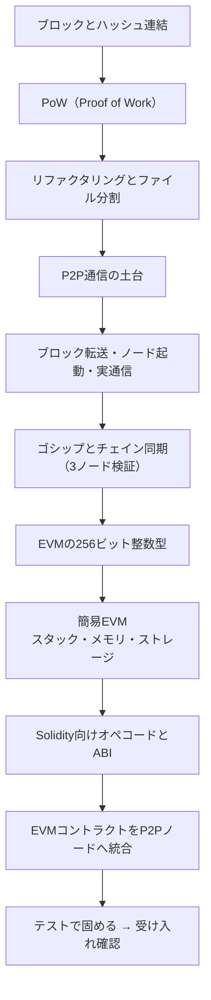

Zig 言語でブロックチェインをゼロから作る本を、無料で公開しました。

📖 [Zig言語で学ぶブロックチェイン（Zenn）](https://zenn.dev/bull/books/zig-blockchain)

ブロックの生成から、PoW（Proof of Work）、P2P 通信とチェイン同期、そして Solidity の一部のオペコードを実行できる簡易 EVM まで。ひととおり自分の手で動かせるところまで書きました。読んで分かった気になる本ではなく、**自分で実装しながら仕組みを学ぶ工作キット**として作っています。

## なぜ「読む本」ではなく「作る本」にしたのか

前に、[エンジニアは「学ぶ」のではなく「作る」ことでしか成長しない](/blog/engineer-growth-by-building)という話を書きました。ブロックチェインほど、この考えが当てはまる題材はないと思っています。

ブロックチェインの解説記事はいくらでもあります。「ブロックがハッシュで繋がっていて」「マイニングで」「分散台帳で」——言葉としては、たぶん誰でも説明できる。でも、その言葉のあいだにある実装の穴は、手を動かすまで見えません。

- ハッシュが繋がっているとは、コードのどこで、何を、何に食わせることか
- ノードが 2 台になった瞬間、何を、どのような順序で送り合うのか
- コントラクトを「実行する」とは、結局どんなループを回すことなのか

このあたりは、動くコードを自分で書いて初めて腑に落ちます。だから本書は、章を追うごとに手元のコードが育っていく構成にしました。

## なぜ Zig なのか

正直に言うと、実用性で選んだわけではありません。Zig の、メモリを自分で握る感覚と、`comptime`や明示的なアロケータのように「隠さない」思想が、仕組みを学ぶ題材と相性が良かったからです。

ランタイムや GC の裏側に隠れず、確保と解放が目の前にある。ブロックチェインという「データ構造とネットワークと VM の集合体」を、下のレイヤーまで見ながら組むのに向いていました。学ぶための不便さを、あえて選んでいます。

## 本書でたどる道のり

全 20 章。ゼロから、動く学習用ノードまで一本道でたどります。

大きく 3 つのパートに分かれます。

**1. 単体のチェインを作る。**まずは 1 プロセスの中で、ブロックを繋ぎ、PoW で採掘する最小のチェインを作ります。ここで「ブロックが繋がる」の実体を握ります。そのあとリファクタリングしてファイルを分割し、以降の拡張に耐える形に整えます。

**2. ノードを増やして繋ぐ。** Zig で P2P 通信の土台を作り、ブロックを転送し、複数ノードを起動して実際に通信させます。さらにゴシップでブロックを伝播させ、チェインを同期する。最後は 3 ノードを立てて、ちゃんと同じチェインに収束するかを検証します。ここが個人的に一番おもしろいところで、「分散」がコードとして立ち上がる瞬間です。

**3. コントラクトを動かす。** EVM の 256 ビット整数型を実装するところから始めて、スタック・メモリ・ストレージを持つ簡易 EVM を組みます。Solidity 向けのオペコードを揃え、Solidity の ABI を実際に呼び出して動かし、最終的にその EVM を P2P ノードに統合します。テストで EVM と P2P の結合を固め、完成した学習用ノードを受け入れ確認して終わります。

「簡易 EVM」と書いているとおり、本物の EVM を全部再現するものではありません。Solidity の一部のオペコードを実行できるレベルで、それでも「コントラクトが動く」という手応えを掴むには十分だと思っています。

## 正直に書いておくこと ― PoS は未実装

今のイーサリアムが採用しているコンセンサスは PoS（Proof of Stake）ですが、**本書では PoS は実装していません。**発展課題として「PoS を設計する前に考えること」を 1 章置いてあるだけで、動くコードには落とし込めていません。

理由は隠さず書いておきます。ひとつは、Zig のバージョンが上がるたびに破壊的変更が入り、コードの追従にそれなりの体力を持っていかれたこと。そしてもうひとつは、単純に、そこまでで一度力尽きたことです。

書いていて気持ちのいい嘘をつくより、「ここまでは動く、ここから先は未完」と正直に線を引くほうが、学習の工作キットとしては誠実だと思っています。PoS まで含めた続きは、いずれ気力が戻ったら書き足したい。ここは伸びしろとして残しておきます。

## 使い方

写経でも、途中から自分流に改造でも、どちらでも構いません。ソースは GitHub にあります。

- 📖 本体: [Zig言語で学ぶブロックチェイン](https://zenn.dev/bull/books/zig-blockchain)
- 💻 コード: [susumutomita/BlockChain](https://github.com/susumutomita/BlockChain)

Zig のバージョン差で、そのままではビルドが通らない箇所も出ます。それも含めて、詰まったところを自分で直しながら進むのが、たぶん一番身につきます。

## 最後に

ブロックチェインは、データ構造とネットワークと仮想マシンが一箇所に詰まった、学びの題材としてかなり贅沢な対象です。それをライブラリに任せず、自分の手で下から組んでみると、ニュースで流れてくる言葉の解像度が一段変わります。

読んで分かった気になるのではなく、自分の手で作る。**作って、詰まって、直して、分かる。**そういう本にしたつもりです。よかったら手を動かしてみてください。
